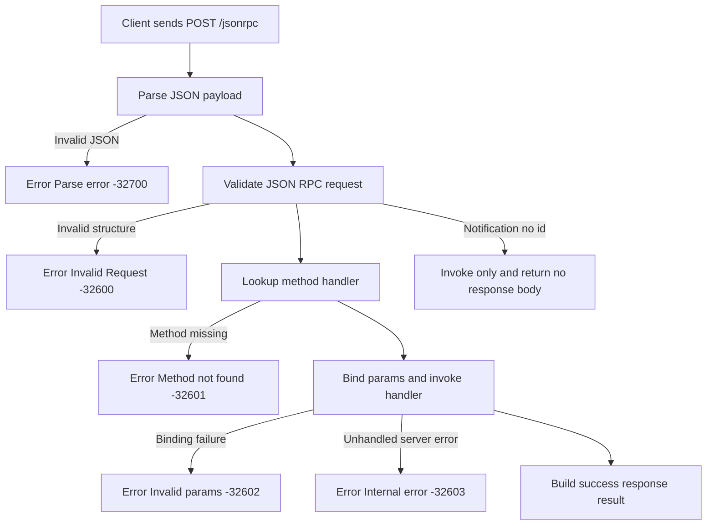

# jsonrpc-spring-boot-starter

JSON-RPC 2.0 server components for Spring Boot.
Baseline: Spring Boot 4.0.2, Gradle 9.3.1.

The library uses JSpecify annotations for nullness contracts on core APIs.

## What Is JSON-RPC 2.0?

JSON-RPC 2.0 is a lightweight remote procedure call protocol using JSON messages.

- Request fields: `jsonrpc`, `method`, optional `params`, optional `id`
- Response fields: `jsonrpc`, `id`, and exactly one of `result` or `error`
- Notification: request without `id` (server must not return a response)
- Batch: array of requests processed in one HTTP call

## Specification References

- JSON-RPC 2.0 Specification: [jsonrpc.org/specification](https://www.jsonrpc.org/specification)
- JSON format standard (IETF): [RFC 8259](https://www.rfc-editor.org/rfc/rfc8259)

## JSON-RPC Flow



## Modules

- `jsonrpc-core`: JSON-RPC 2.0 protocol model and dispatch pipeline
- `jsonrpc-spring-webmvc`: Spring WebMVC transport adapter
- `jsonrpc-spring-boot-autoconfigure`: Spring Boot auto-configuration
- `jsonrpc-spring-boot-starter`: starter dependency bundle

## Quick Start (Basic)

Add starter dependency:

Maven:
```xml
<dependency>
  <groupId>io.github.limehee</groupId>
  <artifactId>jsonrpc-spring-boot-starter</artifactId>
  <version>0.1.0-SNAPSHOT</version>
</dependency>
```

Gradle (Groovy DSL):
```groovy
implementation 'io.github.limehee:jsonrpc-spring-boot-starter:0.1.0-SNAPSHOT'
```

Gradle (Kotlin DSL):
```kotlin
implementation("io.github.limehee:jsonrpc-spring-boot-starter:0.1.0-SNAPSHOT")
```

Use annotation-based registration (recommended for first use):

```java
@Service
class GreetingRpcService {
    @JsonRpcMethod("greet")
    public String greet(GreetParams params) {
        return "hello " + params.name();
    }
}

record GreetParams(String name) {}
```

Default endpoint:
- `POST /jsonrpc`
- `Content-Type: application/json`

Example request:
```json
{"jsonrpc":"2.0","method":"greet","params":{"name":"codex"},"id":1}
```

## Advanced Usage

Use explicit bean registration when you want full control:

```java
@Bean
JsonRpcMethodRegistration pingMethod() {
    return JsonRpcMethodRegistration.of("ping", params -> TextNode.valueOf("pong"));
}
```

Typed registration is also available:

```java
@Bean
JsonRpcMethodRegistration greet(JsonRpcTypedMethodHandlerFactory factory) {
    return JsonRpcMethodRegistration.of(
            "greet",
            factory.unary(GreetParams.class, params -> "hello " + params.name()));
}
```

`@JsonRpcMethod` supports:
- no params
- one typed param (`params` object/array mapped via Jackson)
- multiple params with positional array (`params` as `[arg1,arg2,...]`)
- multiple params with named object using `@JsonRpcParam` on each parameter

Named object binding also works with Java parameter names (compiled with `-parameters`, enabled by default in this project).

Custom HTTP status mapping:
```java
@Bean
JsonRpcHttpStatusStrategy jsonRpcHttpStatusStrategy() {
    return new DefaultJsonRpcHttpStatusStrategy();
}
```

Custom interceptor:
```java
@Bean
JsonRpcInterceptor auditInterceptor() {
    return new JsonRpcInterceptor() {
        @Override
        public void beforeInvoke(JsonRpcRequest request) {
            // audit
        }
    };
}
```

## Configuration

- `jsonrpc.path` (default `/jsonrpc`)
- `jsonrpc.max-batch-size` (default `100`)
- `jsonrpc.max-request-bytes` (default `1048576`)
- `jsonrpc.scan-annotated-methods` (default `true`)
- `jsonrpc.include-error-data` (default `false`)
- `jsonrpc.metrics-enabled` (default `true`, requires `MeterRegistry`)
- `jsonrpc.notification-executor-enabled` (default `false`, uses available `Executor` bean)
- `jsonrpc.notification-executor-bean-name` (default empty, explicit `Executor` bean name for notifications)
- `jsonrpc.method-allowlist` (default empty)
- `jsonrpc.method-denylist` (default empty)
- `jsonrpc.method-registration-conflict-policy` (default `REJECT`, or `REPLACE`)

Notes:
- Reserved methods starting with `rpc.` are always blocked for JSON-RPC compliance.
- If both allowlist and denylist include the same method, denylist wins.
- When multiple `Executor` beans exist, notifications run direct unless `jsonrpc.notification-executor-bean-name` is set (or `applicationTaskExecutor` exists).
- Invalid configuration now fails fast at startup (for example: non-positive `max-batch-size`, non-positive `max-request-bytes`, blank method list entries, invalid path format).

Validation rules:
- `jsonrpc.path`: must start with `/` and contain no whitespace
- `jsonrpc.max-batch-size`: must be greater than `0`
- `jsonrpc.max-request-bytes`: must be greater than `0`
- `jsonrpc.method-allowlist` / `jsonrpc.method-denylist`: entries must not be blank

To execute notifications asynchronously, set `jsonrpc.notification-executor-enabled=true` and provide an `Executor` bean.

Provide a custom `JsonRpcHttpStatusStrategy` bean to override HTTP status mapping (single, batch, notifications, parse errors, payload limit errors).

## Sample Module

A runnable Spring Boot sample is provided at:
- `samples/spring-boot-demo`

Run it:
```bash
./gradlew -p samples/spring-boot-demo bootRun
```

## Build

```bash
./gradlew test
```

API compatibility check (against a released baseline version):
```bash
./gradlew apiCompat -PapiBaselineVersion=0.1.0
```

Benchmark (JMH):
```bash
./gradlew :jsonrpc-core:jmh
```

Dependencies are managed with Gradle Version Catalog at `gradle/libs.versions.toml`.
Spring Boot configuration metadata hints are provided for IDE auto-completion.

## Publish

Set OSSRH and signing credentials via `gradle.properties` or environment variables:

- `OSSRH_USERNAME`, `OSSRH_PASSWORD`
- `SIGNING_KEY`, `SIGNING_PASSWORD`

Then run:

```bash
./gradlew publish
```

GitHub Actions workflows:
- `.github/workflows/ci.yml`: build and test on push/PR
- `.github/workflows/publish.yml`: publish on tag push (`v*`) or manual dispatch

## Contributing

- Contribution guide: `CONTRIBUTING.md`
- Release checklist: `docs/release-checklist.md`
- Issue templates: `.github/ISSUE_TEMPLATE/`
- PR template: `.github/pull_request_template.md`
