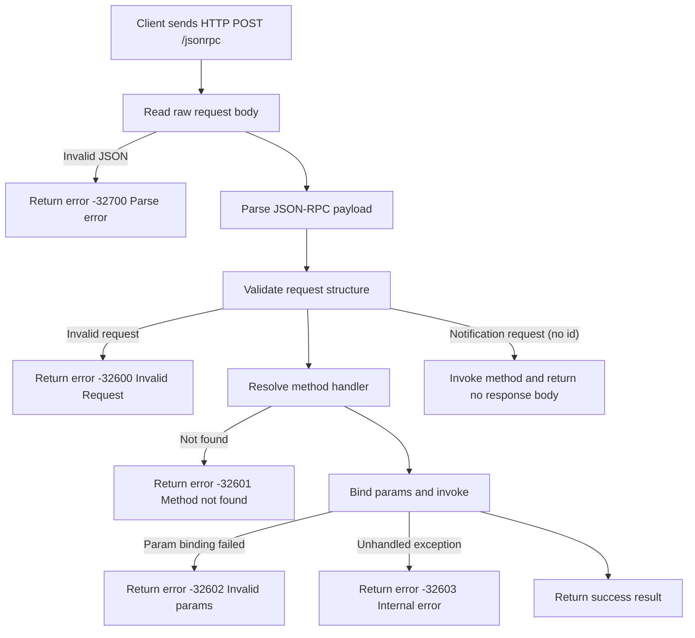

# jsonrpc-spring-boot-starter

Production-oriented JSON-RPC 2.0 server library for Java and Spring Boot.

- JSON-RPC 2.0 compliant request/response/error model
- Transport-agnostic core (`jsonrpc-core`) usable in plain Java
- Spring WebMVC adapter + Spring Boot auto-configuration/starter
- Extension points for registration, interceptors, metrics, access control, and notification execution

## Specification

- JSON-RPC 2.0: <https://www.jsonrpc.org/specification>
- JSON (RFC 8259): <https://www.rfc-editor.org/rfc/rfc8259>

## Version Baseline

- Java: 17+
- Spring Boot baseline: 4.0.2
- Build: Gradle (Version Catalog enabled)

## Modules

- `jsonrpc-core`: protocol model, parser/validator/dispatcher, method registry, typed binding adapters
- `jsonrpc-spring-webmvc`: HTTP endpoint adapter and status strategy
- `jsonrpc-spring-boot-autoconfigure`: property binding, bean wiring, annotation scanning, optional metrics/access policies
- `jsonrpc-spring-boot-starter`: dependency bundle for Spring Boot apps

## Quick Start

### 1) Add dependency

Maven:

```xml
<dependency>
  <groupId>io.github.limehee</groupId>
  <artifactId>jsonrpc-spring-boot-starter</artifactId>
  <version>0.1.0-SNAPSHOT</version>
</dependency>
```

Gradle (Kotlin DSL):

```kotlin
implementation("io.github.limehee:jsonrpc-spring-boot-starter:0.1.0-SNAPSHOT")
```

Gradle (Groovy DSL):

```groovy
implementation 'io.github.limehee:jsonrpc-spring-boot-starter:0.1.0-SNAPSHOT'
```

### 2) Expose a method

```java
import com.limehee.jsonrpc.core.JsonRpcMethod;
import org.springframework.stereotype.Service;

@Service
class GreetingRpcService {
    @JsonRpcMethod("greet")
    public String greet(GreetParams params) {
        return "hello " + params.name();
    }

    record GreetParams(String name) {}
}
```

### 3) Call endpoint

Default endpoint is `POST /jsonrpc` with `application/json`.

Request:

```json
{"jsonrpc":"2.0","method":"greet","params":{"name":"codex"},"id":1}
```

Response:

```json
{"jsonrpc":"2.0","id":1,"result":"hello codex"}
```

## Documentation

Full documentation entrypoint: [`docs/index.md`](docs/index.md).

- Documentation Home: [`docs/index.md`](docs/index.md)
- Getting Started: [`docs/getting-started.md`](docs/getting-started.md)
- Spring Boot Guide: [`docs/spring-boot-guide.md`](docs/spring-boot-guide.md)
- Pure Java Guide: [`docs/pure-java-guide.md`](docs/pure-java-guide.md)
- Protocol Compliance: [`docs/protocol-and-compliance.md`](docs/protocol-and-compliance.md)
- Registration and Binding: [`docs/registration-and-binding.md`](docs/registration-and-binding.md)
- Configuration Reference: [`docs/configuration-reference.md`](docs/configuration-reference.md)
- Extension Points: [`docs/extension-points.md`](docs/extension-points.md)
- Testing and Quality: [`docs/testing-and-quality.md`](docs/testing-and-quality.md)
- Performance: [`docs/performance.md`](docs/performance.md)
- Troubleshooting: [`docs/troubleshooting.md`](docs/troubleshooting.md)

## JSON-RPC Flow



## Build and Test

```bash
./gradlew check
./gradlew test integrationTest e2eTest
./gradlew apiCompat -PapiBaselineVersion=<released-version>
./gradlew :jsonrpc-core:jmh
```

## Sample Application

- Sample app: [`samples/spring-boot-demo`](samples/spring-boot-demo)
- Run sample:

```bash
./gradlew -p samples/spring-boot-demo bootRun
```

## Contributing and Release

- Contributing guide: [`CONTRIBUTING.md`](CONTRIBUTING.md)
- Release checklist: [`docs/release-checklist.md`](docs/release-checklist.md)
- Changelog: [`CHANGELOG.md`](CHANGELOG.md)
