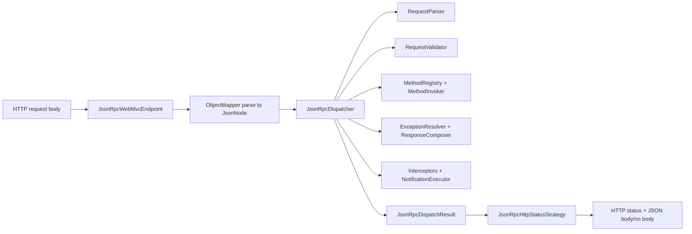

# Architecture

This project separates protocol logic from transport and framework wiring.

## 1. Module Responsibilities

| Module                              | Responsibility                                                                 | Depends on                                           |
|-------------------------------------|--------------------------------------------------------------------------------|------------------------------------------------------|
| `jsonrpc-core`                      | JSON-RPC 2.0 protocol model and dispatch pipeline                              | Jackson 3, JSpecify                                  |
| `jsonrpc-spring-webmvc`             | Servlet/WebMVC endpoint and HTTP status strategy                               | `jsonrpc-core`, Spring Web                           |
| `jsonrpc-spring-boot-autoconfigure` | Bean wiring, property binding/validation, scanning, metrics/access integration | `jsonrpc-core`, `jsonrpc-spring-webmvc`, Spring Boot |
| `jsonrpc-spring-boot-starter`       | Consumer-facing starter dependency bundle                                      | Core + adapters                                      |

## 2. Runtime Flow (Spring WebMVC)

## 3. Dispatcher Pipeline Contract

`JsonRpcDispatcher` composes these interfaces:

- `JsonRpcRequestParser`
- `JsonRpcRequestValidator`
- `JsonRpcMethodRegistry`
- `JsonRpcMethodInvoker`
- `JsonRpcExceptionResolver`
- `JsonRpcResponseComposer`
- `JsonRpcNotificationExecutor`
- ordered `JsonRpcInterceptor` chain

Design goal: each concern is replaceable without rewriting the dispatcher.

## 4. Registration Lifecycle in Auto-Configuration

Method registration order in Spring Boot:

1. `JsonRpcMethodRegistration` beans during dispatcher creation (`orderedStream`)
2. `@JsonRpcMethod` scanning after singleton initialization (`SmartInitializingSingleton`)

Duplicate behavior is controlled by `jsonrpc.method-registration-conflict-policy`.

## 5. Error Boundary Strategy

Protocol-level normalization:

- parse error -> `-32700`
- invalid request -> `-32600`
- method not found -> `-32601`
- invalid params -> `-32602`
- unhandled exceptions -> `-32603`

Transport-level status is handled separately by `JsonRpcHttpStatusStrategy`.

## 6. Extension Model

Spring Boot users can override pipeline beans because auto-configuration uses `@ConditionalOnMissingBean`.

Typical extension cases:

- custom request validator policy
- domain-specific exception mapping
- custom method registry implementation
- custom notification execution (executor/backpressure/retry)
- alternate HTTP status policy

## 7. Dependency Posture

The runtime stack is intentionally minimal:

- core protocol path does not require Spring
- no direct dependency on Guava, Commons Lang3, or Jakarta Validation API
- Jackson and Spring dependencies are scoped by module responsibility
