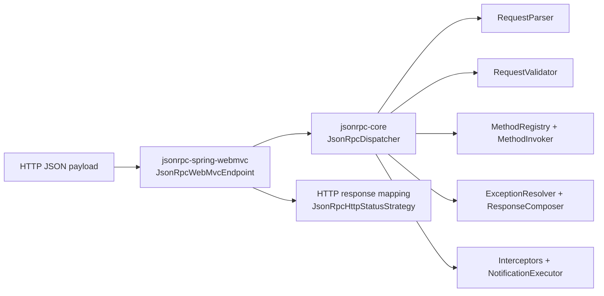

# Architecture

The project is intentionally split into transport-independent core and transport/framework adapters.

## Module Boundaries

- `jsonrpc-core`
- `jsonrpc-spring-webmvc`
- `jsonrpc-spring-boot-autoconfigure`
- `jsonrpc-spring-boot-starter`

## Runtime Flow

## Core Pipeline Components

`JsonRpcDispatcher` orchestrates these interfaces:

- `JsonRpcRequestParser`
- `JsonRpcRequestValidator`
- `JsonRpcMethodRegistry`
- `JsonRpcMethodInvoker`
- `JsonRpcExceptionResolver`
- `JsonRpcResponseComposer`
- `JsonRpcNotificationExecutor`
- `JsonRpcInterceptor` list

Each component can be replaced in Spring via `@Bean` override.

## Registration Models

- Low-level registration with `JsonRpcMethodRegistration` or `dispatcher.register(...)`
- Annotation scanning via `@JsonRpcMethod`
- Typed adapter registration via `JsonRpcTypedMethodHandlerFactory`

## Design Intent

- Keep protocol semantics in `jsonrpc-core`
- Keep HTTP concerns in `jsonrpc-spring-webmvc`
- Keep wiring/property validation in `jsonrpc-spring-boot-autoconfigure`
- Keep starter module dependency-only
