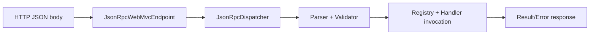

# spring-boot-demo

Spring Boot JSON-RPC 2.0 sample using `jsonrpc-spring-boot-starter`.

## Run

From repository root:

```bash
./gradlew -p samples/spring-boot-demo bootRun
```

Endpoint:

- URL: `http://localhost:8080/jsonrpc`
- method: `POST`
- content type: `application/json`

## Request Flow



## Scenario Requests

### 1. Annotation method (`ping`)

```bash
curl -s http://localhost:8080/jsonrpc \
  -H 'content-type: application/json' \
  -d '{"jsonrpc":"2.0","method":"ping","id":1}'
```

### 2. Single-parameter DTO binding (`greet`)

```bash
curl -s http://localhost:8080/jsonrpc \
  -H 'content-type: application/json' \
  -d '{"jsonrpc":"2.0","method":"greet","params":{"name":"developer"},"id":2}'
```

### 3. Named params with `@JsonRpcParam` (`sum`)

```bash
curl -s http://localhost:8080/jsonrpc \
  -H 'content-type: application/json' \
  -d '{"jsonrpc":"2.0","method":"sum","params":{"left":2,"right":3},"id":3}'
```

### 4. Positional params (`sum`)

```bash
curl -s http://localhost:8080/jsonrpc \
  -H 'content-type: application/json' \
  -d '{"jsonrpc":"2.0","method":"sum","params":[2,3],"id":4}'
```

### 5. Manual registration (`manual.echo`)

```bash
curl -s http://localhost:8080/jsonrpc \
  -H 'content-type: application/json' \
  -d '{"jsonrpc":"2.0","method":"manual.echo","id":5}'
```

### 6. Typed registration (`typed.upper`, `typed.tags`)

```bash
curl -s http://localhost:8080/jsonrpc \
  -H 'content-type: application/json' \
  -d '{"jsonrpc":"2.0","method":"typed.upper","params":{"value":"spring"},"id":6}'
```

```bash
curl -s http://localhost:8080/jsonrpc \
  -H 'content-type: application/json' \
  -d '{"jsonrpc":"2.0","method":"typed.tags","id":7}'
```

### 7. Notification (no response body)

```bash
curl -i -s http://localhost:8080/jsonrpc \
  -H 'content-type: application/json' \
  -d '{"jsonrpc":"2.0","method":"ping"}'
```

### 8. Mixed batch (success + notification + error)

```bash
curl -s http://localhost:8080/jsonrpc \
  -H 'content-type: application/json' \
  -d '[
        {"jsonrpc":"2.0","method":"manual.echo","id":8},
        {"jsonrpc":"2.0","method":"typed.tags"},
        {"jsonrpc":"2.0","method":"missing","id":9}
      ]'
```

### 9. Parse error

```bash
curl -s http://localhost:8080/jsonrpc \
  -H 'content-type: application/json' \
  -d '{'
```

## Notification Executor Scenarios

- Configured executor path is covered by
  `GreetingRpcServiceNotificationExecutorIntegrationTest`.
- Misconfiguration failure path (missing named executor bean) is covered by
  `GreetingRpcServiceNotificationExecutorConfigurationFailureTest`.

## Test Coverage Entry Points

- `src/test/java/com/limehee/jsonrpc/sample/GreetingRpcServiceIntegrationTest.java`
- `src/test/java/com/limehee/jsonrpc/sample/GreetingRpcServiceScenarioCoverageIntegrationTest.java`
- `src/test/java/com/limehee/jsonrpc/sample/GreetingRpcServiceParamsPolicyIntegrationTest.java`
- `src/test/java/com/limehee/jsonrpc/sample/GreetingRpcServiceNotificationExecutorIntegrationTest.java`
- `src/test/java/com/limehee/jsonrpc/sample/GreetingRpcServiceNotificationExecutorConfigurationFailureTest.java`
