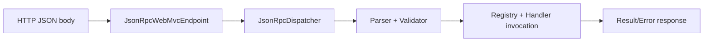

# spring-boot-demo

Spring Boot JSON-RPC 2.0 sample using `jsonrpc-spring-boot-starter`.

## Run

From repository root:

```bash
./gradlew -p samples/spring-boot-demo bootRun
```

## Run Tests

From repository root:

```bash
./gradlew -p samples/spring-boot-demo test
```

Endpoint:

- URL: `http://localhost:8080/jsonrpc`
- method: `POST`
- content type: `application/json`

## Request Flow



## Scenario Requests

### 1. Annotation method (`ping`)

```bash
curl -s http://localhost:8080/jsonrpc \
  -H 'content-type: application/json' \
  -d '{"jsonrpc":"2.0","method":"ping","id":1}'
```

Expected response:

```json
{"jsonrpc":"2.0","id":1,"result":"pong"}
```

### 2. Single-parameter DTO binding (`greet`)

```bash
curl -s http://localhost:8080/jsonrpc \
  -H 'content-type: application/json' \
  -d '{"jsonrpc":"2.0","method":"greet","params":{"name":"developer"},"id":2}'
```

Expected response:

```json
{"jsonrpc":"2.0","id":2,"result":"hello developer"}
```

### 3. Named params with `@JsonRpcParam` (`sum`)

```bash
curl -s http://localhost:8080/jsonrpc \
  -H 'content-type: application/json' \
  -d '{"jsonrpc":"2.0","method":"sum","params":{"left":2,"right":3},"id":3}'
```

Expected response:

```json
{"jsonrpc":"2.0","id":3,"result":5}
```

### 4. Positional params (`sum`)

```bash
curl -s http://localhost:8080/jsonrpc \
  -H 'content-type: application/json' \
  -d '{"jsonrpc":"2.0","method":"sum","params":[2,3],"id":4}'
```

Expected response:

```json
{"jsonrpc":"2.0","id":4,"result":5}
```

### 5. Manual registration (`manual.echo`)

```bash
curl -s http://localhost:8080/jsonrpc \
  -H 'content-type: application/json' \
  -d '{"jsonrpc":"2.0","method":"manual.echo","id":5}'
```

Expected response:

```json
{"jsonrpc":"2.0","id":5,"result":"echo"}
```

### 6. Typed registration (`typed.upper`, `typed.tags`)

```bash
curl -s http://localhost:8080/jsonrpc \
  -H 'content-type: application/json' \
  -d '{"jsonrpc":"2.0","method":"typed.upper","params":{"value":"spring"},"id":6}'
```

Expected response:

```json
{"jsonrpc":"2.0","id":6,"result":{"value":"SPRING"}}
```

```bash
curl -s http://localhost:8080/jsonrpc \
  -H 'content-type: application/json' \
  -d '{"jsonrpc":"2.0","method":"typed.tags","id":7}'
```

Expected response:

```json
{"jsonrpc":"2.0","id":7,"result":["alpha","beta"]}
```

### 7. Notification (no response body)

```bash
curl -i -s http://localhost:8080/jsonrpc \
  -H 'content-type: application/json' \
  -d '{"jsonrpc":"2.0","method":"ping"}'
```

Expected response:

- HTTP status: `204 No Content`
- body: empty

### 8. Mixed batch (success + notification + error)

```bash
curl -s http://localhost:8080/jsonrpc \
  -H 'content-type: application/json' \
  -d '[
        {"jsonrpc":"2.0","method":"manual.echo","id":8},
        {"jsonrpc":"2.0","method":"typed.tags"},
        {"jsonrpc":"2.0","method":"missing","id":9}
      ]'
```

Expected response:

```json
[
  {"jsonrpc":"2.0","id":8,"result":"echo"},
  {"jsonrpc":"2.0","id":9,"error":{"code":-32601,"message":"Method not found"}}
]
```

### 9. Parse error

```bash
curl -s http://localhost:8080/jsonrpc \
  -H 'content-type: application/json' \
  -d '{'
```

Expected response:

```json
{"jsonrpc":"2.0","id":null,"error":{"code":-32700,"message":"Parse error"}}
```

## Notification Executor Scenarios

- Configured executor path is covered by
  `GreetingRpcServiceNotificationExecutorIntegrationTest`.
- Misconfiguration failure path (missing named executor bean) is covered by
  `GreetingRpcServiceNotificationExecutorConfigurationFailureTest`.

## Registration Conflict Policy Scenarios

- `REJECT` startup-failure path and `REPLACE` overwrite path are covered by
  `GreetingRpcServiceConflictPolicyIntegrationTest`.

## Exception Resolver and Error Data Scenarios

- Error-data exposure path (`jsonrpc.include-error-data=true`) is covered by
  `GreetingRpcServiceErrorDataExposureIntegrationTest`.
- Custom exception mapping path (`JsonRpcExceptionResolver` override) is covered by
  `GreetingRpcServiceCustomExceptionResolverIntegrationTest`.

## Validation Profile Scenarios

Spring sample also demonstrates request/response validation key symmetry through properties:

```yaml
jsonrpc:
  validation:
    request:
      require-id-member: true
      allow-fractional-id: false
      reject-response-fields: true
      reject-duplicate-members: true
    response:
      reject-request-fields: true
      reject-duplicate-members: true
      error-code:
        policy: STANDARD_ONLY
```

The outbound composition example in
`src/main/java/com/limehee/jsonrpc/sample/OutboundRequestCompositionExample.java`
also shows both direct `paramsObject(...)` and direct `paramsArray(...)` usage, in addition to
record / POJO / collection / map conversion through `params(JsonNode)`.

Covered by `GreetingRpcServiceValidationProfilesIntegrationTest`:

- request-side validation at the HTTP endpoint (`require-id-member`, fractional ID, polluted request fields, duplicate
  members)
- response-side parser/validator beans (`reject-duplicate-members`, `reject-request-fields`, `error-code.policy`)

## Outbound Request Composition Inside a Spring App

The Spring sample also includes a small core-only example for composing outbound JSON-RPC payloads when the same
application needs to call another JSON-RPC service.

- `src/main/java/com/limehee/jsonrpc/sample/OutboundRequestCompositionExample.java`
- `src/test/java/com/limehee/jsonrpc/sample/OutboundRequestCompositionExampleTest.java`

Covered scenarios:

- single request payload with object params
- request payloads created from a record, a classic Java class, a collection, and a map
- batch payload containing a request and a notification
- manual `JsonRpcError.of(code, message, data)` composition for upstream failures

## Test Coverage Entry Points

- `src/test/java/com/limehee/jsonrpc/sample/GreetingRpcServiceIntegrationTest.java`
- `src/test/java/com/limehee/jsonrpc/sample/GreetingRpcServiceScenarioCoverageIntegrationTest.java`
- `src/test/java/com/limehee/jsonrpc/sample/GreetingRpcServiceParamsPolicyIntegrationTest.java`
- `src/test/java/com/limehee/jsonrpc/sample/GreetingRpcServiceNotificationExecutorIntegrationTest.java`
- `src/test/java/com/limehee/jsonrpc/sample/GreetingRpcServiceNotificationExecutorConfigurationFailureTest.java`
- `src/test/java/com/limehee/jsonrpc/sample/GreetingRpcServiceConflictPolicyIntegrationTest.java`
- `src/test/java/com/limehee/jsonrpc/sample/GreetingRpcServiceErrorDataExposureIntegrationTest.java`
- `src/test/java/com/limehee/jsonrpc/sample/GreetingRpcServiceCustomExceptionResolverIntegrationTest.java`
- `src/test/java/com/limehee/jsonrpc/sample/GreetingRpcServiceValidationProfilesIntegrationTest.java`
- `src/test/java/com/limehee/jsonrpc/sample/OutboundRequestCompositionExampleTest.java`
